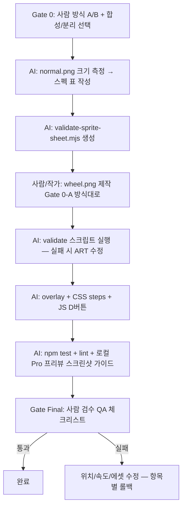

# 챗바퀴 애니메이션 — 통합 작업 지시서 (AI/Codex용)

> **목적:** 사람 개입을 **결정 게이트 + 최종 검수**로만 제한하고, AI가 나머지(코드·검증·문서·정렬 도구)를 자동화한다.  
> **절대 원칙:** 하루치 기존 이미지와 **스타일·픽셀·여백**이 어긋나면 **출시 불가**.

## 0. 확정된 사람 결정 (변경 시 본 문서 갱신)

| 항목 | 결정 |
|------|------|
| 발동 | **D 버튼** (`handleBtn('D')`) |
| 적용 범위 | **Pro 먼저** (`window.IS_PRO`), Basic은 2차 |
| 프레임 크기 | **`normal.png` 실제 픽셀에 맞춤** (AI가 측정 후 스펙 표에 기록) |
| 노션 연동 | **보류** (웹 UI만) |
| 로컬 프리뷰 | `localhost` → Pro 기본 (`index.html` 참고) |

## 1. 미결정 — Gate 0 (사람 1회 선택 후 진행)

### Gate 0-A: 에셋 제작 방식

| 방식 | 스타일 일치도 | 사람 손작업 | ChatGPT 이미지급? | 추천 |
|------|---------------|-------------|-------------------|------|
| **A. 수동 픽셀아트** (Pixelorama/LibreSprite, `normal.png` 레퍼런스 레이어) | **95~100%** | **많음** (직접 또는 외주) | 아님 — 직접 그리거나 트레이스 | **품질 최우선 시** |
| **B. AI 초안 + 수동 보정** | 70~85% → 보정 후 95% | 중간 | 초안만 비슷, **8프레임 통일은 사람 수정 필수** | 시간 절약 타협 |
| **C. AI 8프레임 일괄 생성** | 50~70%, 프레임마다 drift | 적음 | “한 장 예쁘게”는 가능, **시리즈 일관성 실패 빈번** | **비추천** |
| **D. 외주/커미션** | 90~100% (작가 품질 의존) | **검수만** (본인 그리기 0) | 실제 사람 작가 (Fiverr 등) | 외주 경험 있을 때 |
| **E. AI + 오픈소스 툴체인** | 75~92% (반복 후) | **검수만** | ChatGPT 단독 ≠ E. 검증·팔레트·슬라이스는 스크립트 | **외주·픽셀 둘 다 없을 때 추천** |

### Gate 0-E 파이프라인 (외주 없이, 본인 그리기 없이)

| 단계 | 담당 | 도구 |
|------|------|------|
| 1. 레퍼런스 잠금 | AI | `normal.png` 팔레트 추출, Pixel Contract §2 문서화 |
| 2. 초안 생성 | AI + 이미지 모델 | `normal.png` 첨부 프롬프트, **1프레임만** (바퀴/다리 분리 시 2장) |
| 3. 격자·팔레트 검증 | AI 스크립트 | `validate-sprite-sheet.mjs`, `compare-palette.mjs` (신규) |
| 4. 프레임 보정 | AI 반복 | 실패 로그 기준 재생성·슬라이스·oxipng |
| 5. 정렬·CSS | AI | split: `wheel_base.png` + `wheel_hamster.png`, rotate 축 측정 |
| 6. 최종 판정 | **사람** | §6 체크리스트 — 통과 전 커밋 금지 |

**E의 한계 (솔직히):** AI가 8프레임을 한 번에 맞추지 못하면 **3~10회 반복**이 정상. 그래도 사람이 픽셀을 찍지는 않음.

**오픈소스:** oxipng, pngjs/sharp(무손실), Pixelorama/LibreSprite(무료 뷰어·미세 수정), 기존 `wheel-gate0-comparison.html` 정렬 프리뷰.

**사실 정리 (질문 답):**
- 수동 픽셀아트(A) = **픽셀을 찍는 사람**이 필요함. **픽셀아트를 한 번도 안 해봤다면 본인이 A를 할 필요 없음.**
- 본인 역할(미경험자 경로): **스펙 전달 → Gate 0 결정 → 최종 눈 검수(§6)**. 그리기는 **외주(D)** 또는 **AI 초안 + 작가/AI 보정(B)**.
- AI 역할(코드 쪽): **구현, CSS steps, validate 스크립트, 정렬, QA 문서** — 그림 SoT는 Gate 0 통과 후에만.
- **100% 의도 일치**가 목표면 → **D(외주+검수)** 또는 **B(초안+보정)**. C 단독은 피할 것.

**Gate 0-A 통과 조건:** `docs/planning/wheel-gate0-asset.md`에 방식 A/B/C 중 하나 체크 + 담당(본인/외주/AI보조) 기록.

---

### Gate 0-B: 에셋 구성 (합성 vs 분리) — 객관 비교

| 기준 | A. 합성 시트 (햄스터+바퀴 8프레임) | B. 분리 (바퀴 CSS rotate + 햄스터 다리 시트) |
|------|-----------------------------------|-----------------------------------------------|
| **구현 난이도** | 낮음 | 높음 |
| **bg.png 정적 바퀴와 맞추기** | 오버레이 1점만 맞추면 됨 | 바퀴 회전축 + 햄스터 위치 2점 동기화 |
| **바퀴 회전 자연스러움** | 프레임마다 림을 **같이 그려 고정** → 회전감은 다리만 | **진짜 회전** → 가장 자연스러움 |
| **픽셀 깨짐 위험** | 낮음 (`steps` + 정수배) | 중간 (rotate는 서브픽셀 위험 — `pixelated`로 완화) |
| **프레임 간 스타일 drift** | 8칸 모두 손으로 맞춰야 함 | 햄스터 6~8프레임만 맞추면 됨 |
| **1차 출시 적합** | **적합 (Recommended v1)** | 2차 개선용 |
| **실패 시 증상** | 바퀴가 미끄러지듯 보임 | 바퀴·햄스터 어긋남, 축 틀어짐 |

**권장 로드맵 (기본):** v1 = A (합성) → 필요 시 v2 = B.

**현재 확정 (2026-06-10):** **v1 = B (분리)** — 사용자가 comparison 후 분리 방식 선택. 구현 시 바퀴 회전축·햄스터 앵커 이중 정렬 필수.

**Gate 0-B 통과 조건:** v1/v2 중 선택 기록. ✅ **B (분리)** 확정.

**시각 비교 도구:** [wheel-gate0-comparison.html](./wheel-gate0-comparison.html) — 합성 vs 분리 움직임을 브라우저에서 나란히 확인 (플레이스홀더 픽셀, 실제 에셋 불필요).

---

## 2. 픽셀 보존 계약 (Pixel Contract) — AI·코드 필수 준수

```
1. SoT 이미지: tama/assets/hamster/normal.png, tama/assets/scene/bg.png (챗바퀴 crop)
2. 신규 (분리 v1): `wheel_hamster.png` + `wheel_base.png` (git 추적, 로컬 SoT). legacy `wheel.png`는 교체 대상
3. 프레임 그리드: 햄스터 8프레임 — 8×1(125²) 또는 4×2(125²), 셀 크기 100% 동일
4. 배경: 완전 투명, 프레임 밖 픽셀 0 (불필요 여백 금지)
5. 앵커: 모든 프레임 동일 — 바퀴 바닥 접점 = 앵커 (위치 흔들림 금지)
6. 웹 표시: nativeFrameSize × integerScale 만 허용 (예: 128→256=2x)
7. CSS: animation-timing-function: steps(8) only — ease/linear 금지
8. image-rendering: pixelated (또는 crisp-edges)
9. PNG: lossless only — oxipng 허용, pngquant 금지
10. AI 이미지 생성물을 SoT로 쓰지 말 것 (Gate 0-A가 C가 아닌 이상)
```

---

## 3. 기술 스펙 (코드 — AI 구현 대상)

### 3.1 파일

| 파일 | 역할 |
|------|------|
| `tama/assets/animations/wheel_run.png` | **최종 시트 ✅** — 8×1, 셀 224×224 (run.png 재슬라이스·정렬) |
| `tama/assets/animations/_candidates/` | 후보·QA 산출물 (참고용, 배포 제외 가능) |
| `tama/assets/animations/wheel.png` | legacy — SoT 아님 (검증 FAIL 기록) |
| `tama/index.html` | `#wheelOverlay` div 추가 |
| `tama/css/styles.css` | `--wheel-*` 변수, `@keyframes wheelRun`, `.wheel-overlay` |
| `tama/js/game.js` | `showWheelAnimation()`, `stopWheelAnimation()`, `handleBtn('D')` 연결 |
| `scripts/validate-sprite-sheet.mjs` | 시트 격자·크기 자동 검증 (신규) |
| `docs/qa/wheel-animation-qa.md` | 사람 최종 검수 체크리스트 (신규) |

### 3.2 그루밍 패턴 재사용

- `#hamster` img 숨김 (`.grooming` 클래스 패턴)
- 별도 overlay div에 `background-image` + CSS animation
- `game.isBusy` 가드

### 3.3 Pro only

```javascript
if (!window.IS_PRO) return // D 버튼 기존 placeholder 유지
```

### 3.4 위치 변수 (테마별)

```css
/* classic / haruchi1 각각 bg 챗바퀴 위치 다를 수 있음 */
body[data-frame-theme="classic"] { --wheel-left: ...; --wheel-top: ...; }
body.app-tier-pro[data-frame-theme="haruchi1"] { --wheel-left: ...; --wheel-top: ...; }
```

AI는 **bg.png 위 정적 바퀴 중심**에 맞출 때까지 DevTools로 수치 기록 → CSS 변수에 반영.

---

## 4. AI 작업 파이프라인 (사람 개입 최소화)



### Phase별 AI 할 일 / 사람 할 일

| Phase | AI | 사람 |
|-------|-----|------|
| 0 | Gate 0 문서 템플릿 생성 | **A/B/C, 합성/분리 선택 (5분)** |
| 1 | `normal.png` 치수 측정, `wheel-gate0-asset.md` 채우기 | 에셋 제작 (또는 외주) |
| 2 | `validate-sprite-sheet.mjs` + 실행 | 실패 시 시트만 수정 |
| 3 | HTML/CSS/JS 구현, Pro 가드 | 없음 |
| 4 | `wheel-animation-qa.md` 작성, harness/test | **최종 눈 검수 (10분)** |

---

## 5. Codex 통합 프롬프트 (복붙 1장)

```text
# Haruchi-game — Wheel Animation Implementation

Read first (order):
1. docs/planning/WHEEL_ANIMATION_SPEC.md (this spec — law)
2. tama/WHEEL_SETUP.md, tama/WHEEL_ANIMATION_GUIDE.md
3. tama/js/game.js — showGroomingAnimation() pattern
4. Gate 0 files: docs/planning/wheel-gate0-asset.md (must be filled by human)

Hard rules (Pixel Contract §2):
- No AI-generated wheel.png as final asset unless gate says B/C
- Integer scale only; steps(8); pixelated; no pngquant
- Pro only (IS_PRO); trigger: handleBtn('D')
- Match normal.png palette/outline; anchor fixed across 8 frames

Tasks:
1. Measure tama/assets/hamster/normal.png → record native W×H in spec table
2. Create scripts/validate-sprite-sheet.mjs (--cols 4 --rows 2)
3. When wheel.png exists: run validator; abort code merge if fail
4. Implement #wheelOverlay + CSS wheelRun + showWheelAnimation/stopWheelAnimation
5. Wire handleBtn('D') for Pro; keep Basic unchanged
6. Write docs/qa/wheel-animation-qa.md (human checklist)
7. npm run lint && npm test — all green

Do NOT:
- Change tama/assets/hamster/* or bg.png without explicit approval
- Use fractional background-size percentages without pixel math doc
- Use setInterval for wheel frames (CSS steps only)

Deliver: PR-ready diff + QA checklist + measured --wheel-left/top values per theme
```

---

## 6. 사람 최종 검수 체크리스트 (Gate Final)

검수자는 **100% 줌** + **Live Server Pro** (`localhost`)에서만 판정.

### 이미지·스타일

- [ ] `normal.png`와 윤곽선 두께·색감·눈 하이라이트가 동일 계열
- [ ] 8프레임 모두 바퀴 림 위치가 **1~2px 이내** (합성 v1 기준)
- [ ] 프레임 밖 **유령 픽셀/여백** 없음 (투명만)
- [ ] bg.png 정적 챗바퀴와 **이중으로 겹쳐 보이지 않음** (가리거나 정확히 일치)

### 픽셀·애니메이션

- [ ] 픽셀 **흐림/보간** 없음 (줌인 시 계단 현상 = 정상)
- [ ] 루프 시 **8→1 점프** 없음
- [ ] 속도 0.65~0.85s 루프에서 **자연스러움** (과속/뚝뚝 아님)

### 게임

- [ ] D 버튼 → Pro에서만 재생, Basic은 기존 동작
- [ ] 재생 중 다른 액션 차단 (`isBusy`)
- [ ] 그루밍(A)과 충돌 없음

### 실패 시 롤백 우선순위

1. `--wheel-left/top` CSS만 조정  
2. `animation-duration` 조정  
3. `wheel.png` 프레임별 앵커 수정  
4. Gate 0-B 재검토 (분리 방식)

---

## 7. 관련 문서·이슈

| 문서 | 내용 |
|------|------|
| [WHEEL_ANIMATION_GUIDE.md](../../tama/WHEEL_ANIMATION_GUIDE.md) | 프레임 구성·제미나이 프롬프트 |
| [WHEEL_SETUP.md](../../tama/WHEEL_SETUP.md) | 4×2 CSS keyframes |
| [LAYER_GUIDE.md](../../tama/LAYER_GUIDE.md) | 레이어·위치 |
| [wheel-gate0-asset.md](./wheel-gate0-asset.md) | Gate 0 사람 선택 기록 (템플릿) |

## 8. 측정 기록표 (Phase 1 완료 — 2026-06-10)

| 항목 | 값 |
|------|-----|
| `normal.png` native W×H | **500×500** |
| `normal.png` content bbox (opaque) | **124×146** px (앵커 참고) |
| `normal.png` opaque palette | **7838** colors → [`normal-palette.json`](./normal-palette.json) |
| CSS `--normal-width/height` | **290×290** (0.58× — **비정수 스케일, 기존 부채**) |
| grooming cell (4×4 on 500²) | **125×125** |
| grooming overlay display (JS default) | **120px** (0.96× cell) |
| `bg.png` native | **1392×768** |
| **최종 `wheel_run.png`** | **1792×224** — 8×1, 셀 **224×224** (validate PASS, 앵커 spread 9px) |
| 시트 출처 | `run.png`(1107×603, 불규칙 격자) → 콘텐츠 검출 + 교차상관 정렬 (frame 0 기준 dy −6~−9 보정) |
| 루프 구성 | **프레임 0–6 루프** (`steps(7)`), **프레임 7 = 정면 마무리 포즈** (정지 시 1회 재생) |
| 유령 픽셀 | run.png x486–488, x567–578 잔여물 — 추출 시 제거 완료 |
| 팔레트 게이트 | 면제 — 기존 SoT(`run.png`) 재슬라이스라 스타일 보증 (신규 생성물에만 적용) |
| legacy `wheel.png` (500², 4×2) | **검증 FAIL** — 팔레트 95% 불일치, 앵커 88px drift → 사용 안 함 |
| **bg 바퀴 (외곽선 측정)** | 중심 (282.5, 320), 지름 346px — flood-fill 자동 측정 |
| **overlay 정합값 (bg 박스 기준)** | `left 1.36%` · `top 10.56%` · `width 37.86%` — [`wheel-alignment.json`](./wheel-alignment.json) |
| 정합 증거 | `_candidates/qa_alignment_proof.png` (합성 검증 완료 — 이중 림 없음) |
| `--wheel-*` 테마별 보정 | Phase 3에서 게임 DOM 기준 재확인 (bg 박스와 동일하면 그대로 사용) |
| animation duration | **0.72s** (기본) |

**측정 산출물:** [`wheel-assets-measurement.json`](./wheel-assets-measurement.json)

**검증 명령:**
```bash
npm run asset:measure
npm run validate:sprite -- tama/assets/animations/wheel_run.png --cols 8 --rows 1 --cell-w 224 --cell-h 224 --anchor-tolerance 10
node scripts/extract-wheel-candidates.mjs   # 후보 재추출 (필요 시)
node scripts/refine-wheel-b.mjs             # 교차상관 정렬 재실행 (필요 시)
```

**위치 결정 도구:** [wheel-candidate-preview.html](./wheel-candidate-preview.html) — bg 위에 드래그해서 left/top % 확보 → Phase 3 CSS `--wheel-*` 값으로 사용.

---

**다음 액션 (Phase 1–3 ✅):**
1. ~~검증 스크립트 + 측정~~ (Phase 1)
2. ~~에셋 확보~~ — `wheel_run.png` validate PASS (Phase 2, 기존 run.png 재슬라이스)
3. ~~구현~~ (Phase 3) — `#wheelOverlay` + CSS `steps(7)` + finish 프레임 + `handleBtn('D')` Pro 가드. 위치는 JS가 bg cover 수식으로 자동 계산 (`computeWheelOverlayRect`)
4. **Phase 4 (남음):** 사람 Gate Final 검수 — [`docs/qa/wheel-animation-qa.md`](../qa/wheel-animation-qa.md) — **통과 후 커밋**
